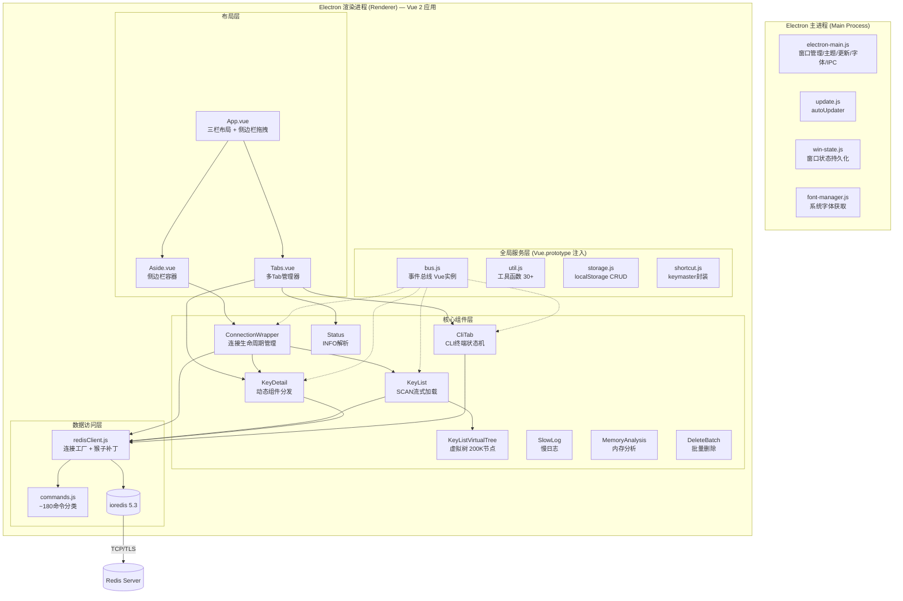
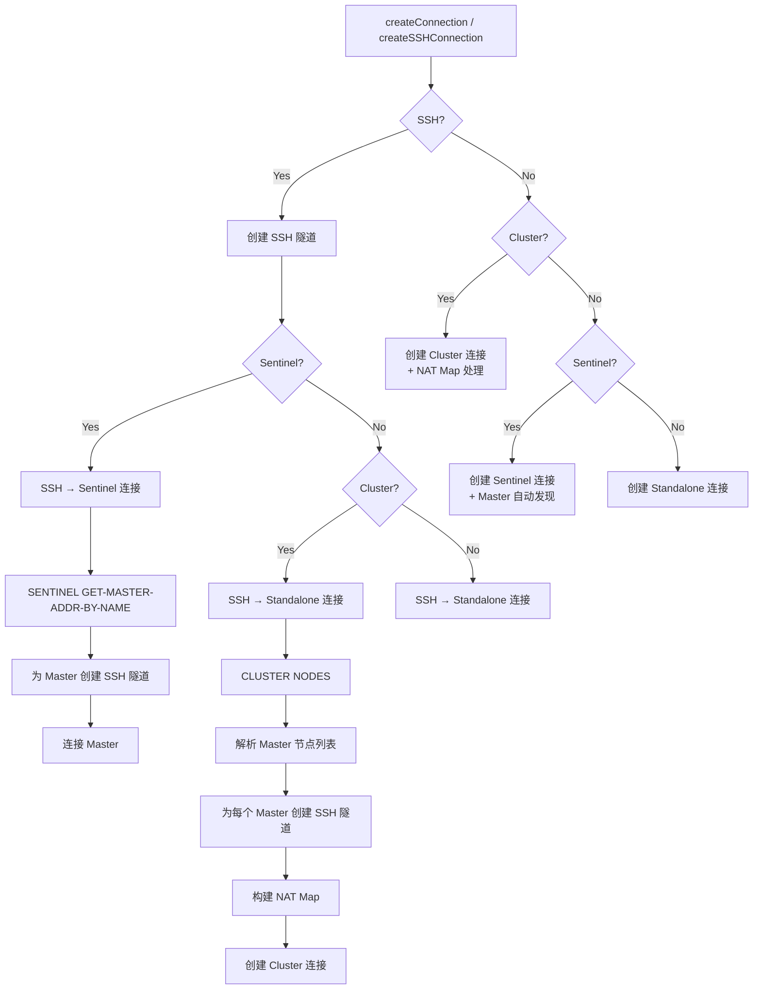
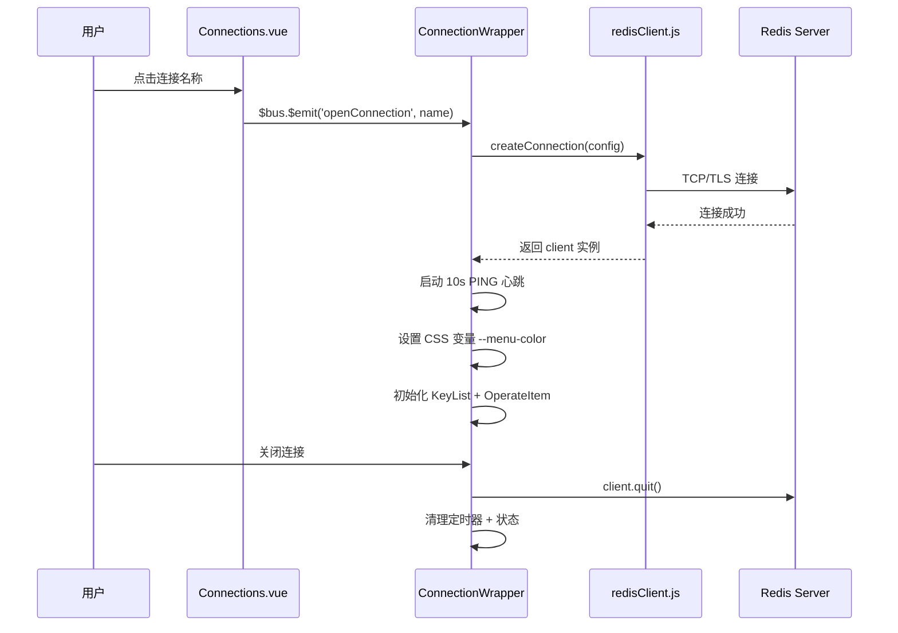
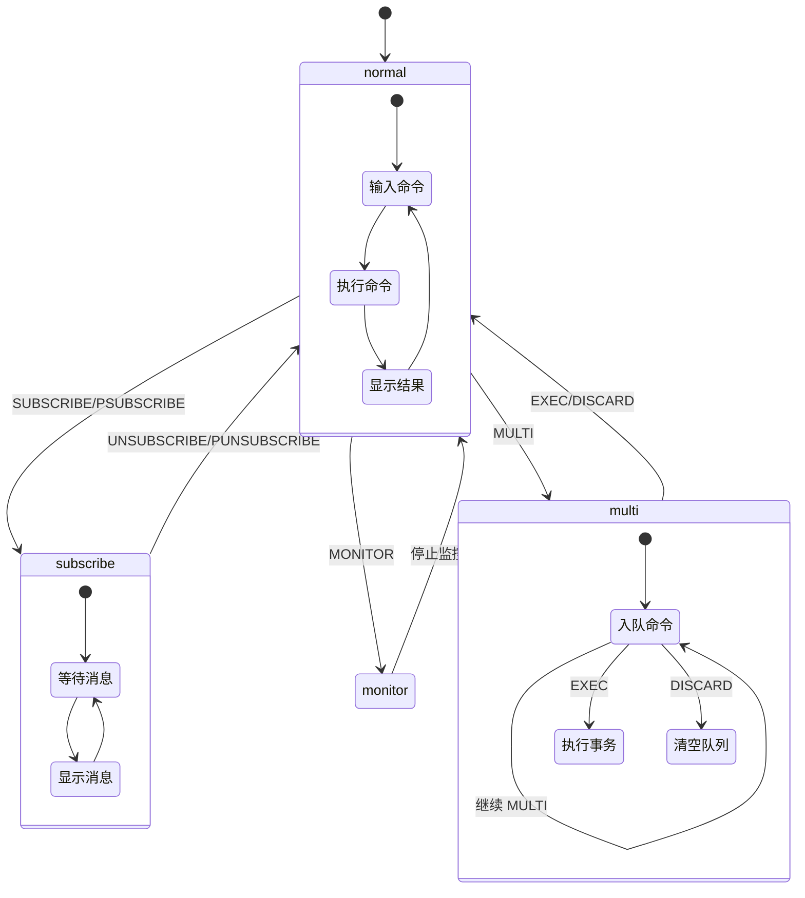
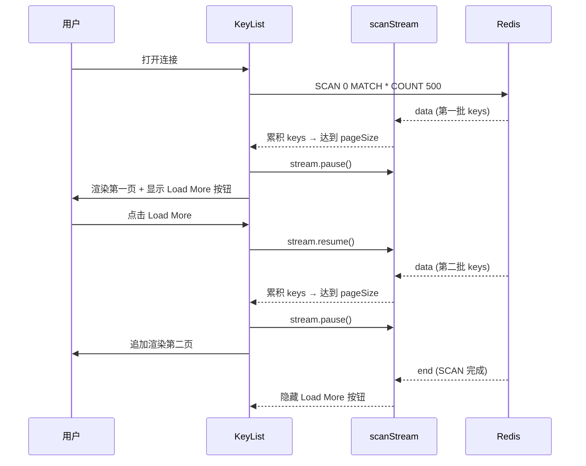
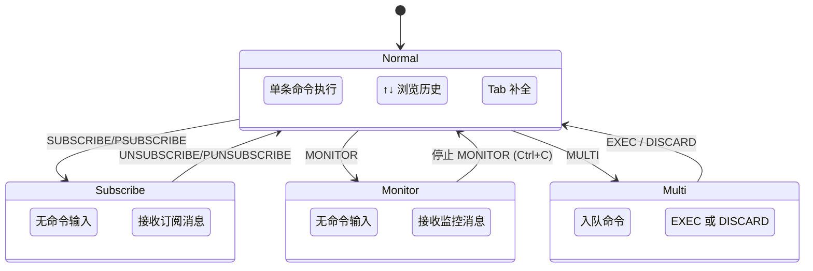
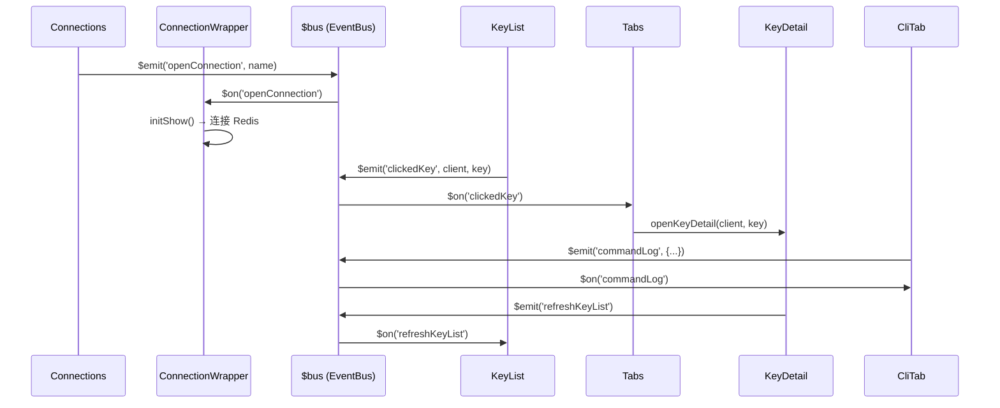

# AnotherRedisDesktopManager 项目完整深度分析

> **基于 56+ 源文件的逐行深度阅读，全面覆盖模块设计、架构设计、功能设计、设计规范**
>
> **项目版本**：1.1.1 | **作者**：qii404
>
> **技术栈**：Vue 2.6 (Options API) + Element UI 2.15 + ioredis 5.3 + Electron 12 + Webpack 4
>
> **文档目标**：为 ran-rs-desktop (Vue 3 + Tauri + Rust) 迁移提供完整参考

---

## 目录

1. [一、项目概览](#一项目概览)
2. [二、架构设计](#二架构设计)
3. [三、模块详细设计](#三模块详细设计)
4. [四、核心机制深度解析](#四核心机制深度解析)
5. [五、设计模式总结](#五设计模式总结)
6. [六、设计规范](#六设计规范)
7. [七、架构缺陷与改进建议](#七架构缺陷与改进建议)
8. [八、迁移到 Tauri + Vue 3 的关键映射](#八迁移到-tauri--vue-3-的关键映射)

---

## 一、项目概览

### 1.1 项目定位

AnotherRedisDesktopManager（以下简称 ARDM）是一个跨平台（Windows/macOS/Linux）的 Redis 桌面管理客户端，定位为"更快、更好、更稳定"的轻量级 Redis GUI 工具。

### 1.2 核心特性

| 特性 | 说明 |
|------|------|
| **连接模式** | Standalone / SSH / Cluster / Sentinel / SSH+Cluster / SSH+Sentinel / TLS |
| **数据类型** | String / Hash / List / Set / Zset / Stream / ReJSON 共 7 种 |
| **格式查看器** | 14 种数据格式自动检测（JSON/Hex/MsgPack/Protobuf/Gzip/Brotli 等） |
| **CLI 终端** | 命令执行 + 自动补全 + MULTI/EXEC + SUBSCRIBE + MONITOR |
| **国际化** | 13 种语言 |
| **工具集** | 服务器状态 / 慢日志 / 内存分析 / 批量删除 |

### 1.3 项目规模

| 维度 | 数量 |
|------|------|
| 源码文件（`.vue/.js`） | 65+ |
| 核心组件 | 35 个 `.vue` 文件 |
| 工具/服务模块 | 8 个 `.js` 文件 |
| 国际化语言 | 13 种 |
| npm 运行时依赖 | 19 个 |
| 代码行数（估算） | ~15,000 行 |

### 1.4 文件分类统计

| 分类 | 文件数 | 代表文件 |
|------|--------|----------|
| 核心基础设施 | 8 | `main.js`, `App.vue`, `bus.js`, `storage.js`, `util.js`, `redisClient.js`, `commands.js`, `addon.js`, `shortcut.js` |
| 连接管理组件 | 4 | `Connections.vue`, `ConnectionWrapper.vue`, `ConnectionMenu.vue`, `NewConnectionDialog.vue` |
| Key 列表组件 | 3 | `KeyList.vue`, `KeyListNormal.vue`, `KeyListVirtualTree.vue` |
| Key 详情组件 | 2 | `KeyDetail.vue`, `KeyHeader.vue` |
| 操作组件 | 1 | `OperateItem.vue` |
| Tab 管理组件 | 1 | `Tabs.vue` |
| CLI 终端组件 | 2 | `CliTab.vue`, `CliContent.vue` |
| 工具组件 | 4 | `Status.vue`, `SlowLog.vue`, `MemoryAnalysis.vue`, `DeleteBatch.vue` |
| 数据类型组件 | 7 | `KeyContent{String/Hash/List/Set/Zset/Stream/ReJson}.vue` |
| 格式查看器 | 16 | `FormatViewer.vue` + 14 个 Viewer + `JsonEditor.vue` |
| 设置/日志/辅助 | 8 | `Setting.vue`, `CommandLog.vue`, `HotKeys.vue`, `CustomFormatter.vue` 等 |
| 国际化 | 14 | `i18n.js` + 13 种语言文件 |
| Electron | 4 | `electron-main.js`, `update.js`, `win-state.js`, `font-manager.js` |
| 构建配置 | 7 | Webpack configs + babel + postcss |
| **总计** | **~70** | |

---

## 二、架构设计

### 2.1 整体架构图



### 2.2 架构特征分析

#### 2.2.1 无状态管理库

ARDM **不使用 Vuex/Pinia**，采用三种机制管理状态：

1. **Vue.prototype 全局注入**（4 个服务）:
   - `$bus` — 事件总线（20+ 事件）
   - `$util` — 工具函数（30+ 函数）
   - `$storage` — localStorage CRUD
   - `$shortcut` — 快捷键绑定

2. **EventBus 事件驱动** ([`bus.js`](AnotherRedisDesktopManager/src/bus.js:1)):
   ```javascript
   // bus.js — 基于 new Vue() 的事件总线
   import Vue from 'vue';
   export default new Vue();
   // 使用: $bus.$on / $bus.$off / $bus.$emit / $bus.$once
   ```

3. **localStorage 持久化** ([`storage.js`](AnotherRedisDesktopManager/src/storage.js:1)) — 连接配置、设置、CLI 历史等

#### 2.2.2 事件总线完整事件清单

| 事件名 | 发布者 | 订阅者 | 用途 |
|--------|--------|--------|------|
| `openConnection` | `Connections.vue` | `ConnectionWrapper.vue` | 打开连接 |
| `closeConnection` | 多处 | `ConnectionWrapper.vue` | 关闭连接 |
| `refreshConnections` | `addon.js` / `Setting.vue` | `Connections.vue` | 刷新连接列表 |
| `clickedKey` | `KeyList*.vue` | `Tabs.vue` → `KeyDetail.vue` | 打开 Key 详情 |
| `openStatus` | `ConnectionMenu.vue` | `Tabs.vue` | 打开状态 Tab |
| `openCli` | `ConnectionMenu.vue` | `Tabs.vue` | 打开 CLI Tab |
| `openDelBatch` | `ConnectionMenu.vue` | `Tabs.vue` | 打开批量删除 Tab |
| `memoryAnalysis` | `ConnectionMenu.vue` | `Tabs.vue` | 打开内存分析 Tab |
| `slowLog` | `ConnectionMenu.vue` | `Tabs.vue` | 打开慢日志 Tab |
| `removePreTab` / `removeAllTab` | `Tabs.vue` | 自身 | Tab 管理 |
| `refreshKeyList` | 多处 | `KeyList.vue` | 刷新 Key 列表 |
| `changeDb` | `OperateItem.vue` / `CliTab.vue` | `CliTab.vue` / `OperateItem.vue` | DB 切换同步 |
| `commandLog` | `redisClient.js` (猴子补丁) | `CommandLog.vue` | 命令日志记录 |
| `reloadSettings` | `Setting.vue` | `App.vue` → `addon.js` | 重载设置 |
| `update-check` | `App.vue` | `UpdateCheck.vue` | 检查更新 |
| `duplicateConnection` | `ConnectionMenu.vue` | `Connections.vue` | 复制连接 |
| `fontInited` | `addon.js` | `JsonEditor.vue` 等 | 字体初始化完成 |
| `changeMatchMode` | `OperateItem.vue` | `KeyList.vue` | 切换精确/模糊搜索 |
| `refreshViewers` | `CustomFormatter.vue` | `FormatViewer.vue` | 刷新查看器列表 |
| `addCustomFormatter` | `CustomFormatter.vue` | `FormatViewer.vue` | 添加自定义格式化器 |

#### 2.2.3 组件层级树

```
App.vue (根布局: el-container → el-aside + el-main)
├── Aside.vue (左侧边栏, 宽度 265px, 可拖拽 200-1500px)
│   ├── NewConnectionDialog.vue (新建/编辑连接弹窗)
│   ├── Setting.vue (设置弹窗)
│   │   ├── LanguageSelector.vue (语言选择器)
│   │   └── CustomFormatter.vue → FileInput.vue
│   ├── CommandLog.vue (命令日志弹窗)
│   ├── HotKeys.vue (快捷键提示弹窗)
│   └── Connections.vue (连接列表, sortablejs 拖拽排序)
│       └── ConnectionWrapper.vue × N (每个激活连接)
│           └── ConnectionMenu.vue (连接右键菜单)
│               ├── OperateItem.vue (DB选择器 + 搜索 + 新建Key + 视图切换)
│               └── KeyList.vue (Key列表容器)
│                   ├── KeyListNormal.vue (平铺列表模式)
│                   └── KeyListVirtualTree.vue (虚拟树模式, @qii404/vue-easy-tree)
└── Tabs.vue (右侧多Tab管理, 6种Tab类型)
    ├── Status.vue (服务器状态)
    ├── CliTab.vue (CLI 终端)
    │   └── CliContent.vue (Monaco 只读编辑器)
    ├── KeyDetail.vue (Key 详情)
    │   ├── KeyHeader.vue (Key 头部操作: TTL/重命名/删除/刷新)
    │   ├── KeyContentString.vue → FormatViewer.vue
    │   ├── KeyContentHash.vue → vxe-table (HSCAN分页)
    │   ├── KeyContentList.vue → vxe-table (LRANGE分页)
    │   ├── KeyContentSet.vue → vxe-table (SSCAN分页)
    │   ├── KeyContentZset.vue → vxe-table (ZSCAN分页)
    │   ├── KeyContentStream.vue → vxe-table (XREVRANGE分页)
    │   ├── KeyContentReJson.vue → Monaco Editor
    │   └── FormatViewer.vue (格式查看器容器)
    │       ├── JsonEditor.vue (Monaco JSON 编辑器, json-bigint)
    │       └── Viewer{Text/Hex/Binary/Json/Msgpack/PHPSerialize/
    │              JavaSerialize/Pickle/Gzip/Brotli/Deflate/DeflateRaw/
    │              Protobuf/Custom/OverSize}.vue (14个查看器)
    ├── DeleteBatch.vue (批量删除)
    ├── MemoryAnalysis.vue (内存分析, RecycleScroller)
    └── SlowLog.vue (慢日志, RecycleScroller)
```

---

## 三、模块详细设计

### 3.1 基础设施层

#### 3.1.1 main.js — 应用入口

文件：[`main.js`](AnotherRedisDesktopManager/src/main.js:1)

```javascript
// 全局原型挂载
Vue.prototype.$bus = bus;
Vue.prototype.$util = util;
Vue.prototype.$storage = storage;
Vue.prototype.$shortcut = shortcut;

// Element UI 全局配置
Vue.use(ElementUI, { size: 'small' });

// 全局异常处理
process.on('uncaughtException', (err) => {
  dialog.showMessageBoxSync({ type: 'error', message: err.message });
  process.exit();
});
```

**职责**: Vue 实例化、全局原型挂载、Element UI 配置、Electron 环境适配

#### 3.1.2 bus.js — 事件总线

文件：[`bus.js`](AnotherRedisDesktopManager/src/bus.js:1)

```javascript
import Vue from 'vue';
export default new Vue();
```

**职责**: 提供一个基于 `new Vue()` 的全局事件总线，所有组件通过 `this.$bus.$on/$emit/$off/$once` 通信。

**设计模式**: 单例模式 + 观察者模式

**潜在问题**:
- 无类型安全（纯 JS，事件名是魔术字符串）
- 无法追踪事件流（调试困难）
- 内存泄漏风险（忘记 `$off` 清理）

#### 3.1.3 storage.js — 持久化服务

文件：[`storage.js`](AnotherRedisDesktopManager/src/storage.js:1)

**核心方法**:

| 方法 | 功能 | localStorage Key |
|------|------|------------------|
| `getConnections()` | 获取所有连接配置 | `ardm_connections_{hash}` |
| `addConnection(config)` | 添加连接 | 同上 |
| `deleteConnection(name)` | 删除连接 | 同上 |
| `getSetting()` | 获取应用设置 | `ardm_settings` |
| `saveSettings(settings)` | 保存应用设置 | `ardm_settings` |
| `getCustomFormatter()` | 获取自定义格式化器 | `ardm_custom_formatter` |
| `saveCustomFormatters(list)` | 保存自定义格式化器 | 同上 |
| `getStorageKeyByName(type, name)` | 生成带命名空间的 key | 动态生成 |

**持久化数据枚举**:

| localStorage Key | 内容 | 类型 |
|------------------|------|------|
| `ardm_connections_{hash}` | 连接配置数组 | JSON (Base64) |
| `ardm_settings` | 应用设置对象 | JSON |
| `ardm_custom_formatter` | 自定义格式化器 | JSON |
| `ardm_cli_tip_{name}` | CLI 命令历史 | JSON Array |
| `ardm_search_tip_{name}` | 搜索历史 | JSON Array (Set, ≤200) |
| `ardm_last_db_{name}` | 最后选择的 DB 索引 | Number |
| `ardm_custom_db_{name}` | 自定义 DB 名称 | JSON |
| `ardm_connection_order` | 连接排序 | JSON Array |
| `theme` | 主题模式 | String (light/dark/system) |
| `lang` | 语言代码 | String |
| `IgnoreUpdateVersion_{ver}` | 忽略的更新版本 | String |

**潜在问题**:
- 密码明文存储在 localStorage（无加密）
- 无数据迁移/版本管理机制
- 单点故障（浏览器清除数据即丢失）

#### 3.1.4 util.js — 工具函数集

文件：[`util.js`](AnotherRedisDesktopManager/src/util.js:1)

**核心函数分类**:

| 类别 | 函数 | 功能 |
|------|------|------|
| Buffer 转换 | `bufToString(buf)` | Buffer → UTF-8 字符串 |
| | `bufToHex(buf)` | Buffer → Hex 字符串 |
| | `hexToBuf(hex)` | Hex 字符串 → Buffer |
| | `bufVisible(buf)` | 检测 Buffer 是否可显示为文本 |
| 格式检测 | `isJson(buf)` | JSON 检测（JSON.parse） |
| | `isPHPSerialize(buf)` | PHP 序列化检测 |
| | `isJavaSerialize(buf)` | Java 序列化检测 |
| | `isPickle(buf)` | Python Pickle 检测 |
| | `isMsgpack(buf)` | MessagePack 检测 |
| | `isBrotli(buf)` | Brotli 压缩检测 |
| | `isGzip(buf)` | Gzip 压缩检测 |
| | `isDeflate(buf)` | Deflate 压缩检测 |
| | `isProtobuf(buf)` | Protobuf 检测 |
| | `isDeflateRaw(buf)` | DeflateRaw 检测 |
| 树构建 | `keysToTree(keys, separator)` | 将 Key 数组构建为树结构 |
| 其他 | `formatBytes(bytes)` | 字节数格式化 |
| | `timeAgo(date)` | 相对时间显示 |

**keysToTree 算法详解**:

```javascript
// 输入: ['user:1:name', 'user:1:age', 'user:2:name', 'post:1:title']
// 分隔符: ':'
// 输出:
// {
//   'user': {
//     '1': {
//       'name': { keyNode: true, nameBuffer: <Buffer>, fullName: 'user:1:name' },
//       'age':  { keyNode: true, nameBuffer: <Buffer>, fullName: 'user:1:age' },
//       keyCount: 2
//     },
//     keyCount: 2
//   },
//   'post': {
//     '1': {
//       'title': { keyNode: true, ... },
//       keyCount: 1
//     },
//     keyCount: 1
//   }
// }
```

**关键设计**:
- 文件夹节点 key 以 `F` 前缀 + 全路径名标识
- Key 节点以原始 Buffer key 名标识
- `keyCount` 递归统计子节点数量
- `forceCut = 20000` 限制展开节点数（200K 溢出保护）
- 文件夹在前、Key 在后排序

#### 3.1.5 commands.js — Redis 命令字典

文件：[`commands.js`](AnotherRedisDesktopManager/src/commands.js:1)

**命令分类**:

```javascript
// 所有命令 (含参数提示)
allCMD = {
  GET: 'GET key',
  SET: 'SET key value [EX seconds] [PX milliseconds]',
  CONFIG: ['CONFIG GET parameter', 'CONFIG SET parameter value'],
  // ... ~180 条命令
}

// 命令分类
adminCMD = { DEBUG: 1, CONFIG: 1, SHUTDOWN: 1, ... }  // 管理命令
readCMD  = { GET: 1, HGET: 1, LRANGE: 1, ... }        // 只读命令
writeCMD = { SET: 1, HSET: 1, DEL: 1, ... }           // 写命令
```

**用途**:
1. CLI 自动补全
2. 只读模式拦截（`writeCMD` 字典）
3. 命令参数提示

#### 3.1.6 addon.js — 附加功能模块

文件：[`addon.js`](AnotherRedisDesktopManager/src/addon.js:1)

**职责**:
- CLI 启动参数解析（`process.argv`）
- 系统字体列表获取（Electron IPC → `font-manager.js`）
- 页面缩放配置（`webFrame.setZoomFactor`）
- 外部链接处理（`shell.openExternal`）
- 窗口拖拽区域配置（`-webkit-app-region: drag`）
- 字体初始化事件广播（`$bus.$emit('fontInited')`）

#### 3.1.7 shortcut.js — 快捷键管理

文件：[`shortcut.js`](AnotherRedisDesktopManager/src/shortcut.js:1)

基于 **keymaster** 封装：

```javascript
// 全局快捷键
ctrl+n / ⌘+n    → 新建连接
ctrl+, / ⌘+,    → 设置
ctrl+g / ⌘+g    → 命令日志
ctrl+w / ⌘+w    → 关闭当前 Tab
ctrl+? / ⌘+?    → 快捷键提示

// Tab 作用域快捷键 (通过 scope 隔离)
ctrl+r / ⌘+r / F5  → 刷新
ctrl+d / ⌘+d       → 删除 Key
ctrl+s / ⌘+s       → 保存
ctrl+l / ⌘+l       → 清屏 (CLI)

// API
$shortcut.bind(keys, scope, handler)    // 绑定
$shortcut.deleteScope(scope)            // 清理作用域 (beforeDestroy)
```

---

### 3.2 连接模块

#### 3.2.1 redisClient.js — 连接工厂

文件：[`redisClient.js`](AnotherRedisDesktopManager/src/redisClient.js:1)

**连接模式枚举**:

| 模式 | 函数 | 协议路径 |
|------|------|----------|
| Standalone | `createConnection()` | TCP → Redis |
| Sentinel | `createConnection()` | TCP → Sentinel → Master |
| Cluster | `createConnection()` | TCP → Cluster (多节点) |
| SSH + Standalone | `createSSHConnection()` | SSH → TCP → Redis |
| SSH + Cluster | `createSSHConnection()` | SSH×N → TCP → Cluster |
| SSH + Sentinel | `createSSHConnection()` | SSH×2 → TCP → Sentinel → Master |
| TLS/SSL | `createConnection()` | TLS → Redis |

**核心流程**:



**猴子补丁 (Monkey Patch)**:

```javascript
// 拦截 Redis.prototype.sendCommand
const originSendCommand = Redis.prototype.sendCommand;
Redis.prototype.sendCommand = function(command, stream) {
  const start = Date.now();
  const result = originSendCommand.call(this, command, stream);

  // 1. 只读模式拦截
  if (this.options.readOnly && writeCMD[command.name.toUpperCase()]) {
    return Promise.reject(new Error('Write command in readonly mode'));
  }

  // 2. 命令日志（可跳过: withoutLogging）
  if (!this.withoutLogging) {
    result.then((reply) => {
      const cost = Date.now() - start;
      Vue.prototype.$bus.$emit('commandLog', {
        command: { name: command.name, args: command.args },
        cost, time: new Date(),
        connectionName: this.options.connectionName,
      });
    });
  }

  return result;
};
```

**HGETALL Reply Transformer**:

```javascript
// 将 Redis HGETALL 返回的扁平数组 [key1, val1, key2, val2] 转为 [[key, val], ...]
Redis.ReplyTransformers = {
  HGETALL: (result) => {
    const arr = [];
    for (let i = 0; i < result.length; i += 2) {
      arr.push([result[i], result[i + 1]]);
    }
    return arr;
  }
};
```

**ConnectionConfig 数据模型**:

```typescript
interface ConnectionConfig {
  host: string;              // Redis 主机地址
  port: number;              // Redis 端口
  auth: string;              // 密码
  username: string;          // ACL 用户名 (Redis 6.0+)
  name: string;              // 连接别名
  separator: string;         // Key 分隔符 (默认 ':')
  connectionName: string;    // 唯一标识 (自动生成)
  cluster: boolean;          // 集群模式
  sentinel: boolean;         // 哨兵模式
  sentinelConfig: {
    name: string;            // Master 名称
    host: string;
    port: number;
    auth: string;
    username: string;
    nodePassword: string;    // Sentinel 节点密码
  };
  sshOptions: {
    host: string;
    port: number;
    username: string;
    password: string;
    privateKey: string;
    passphrase: string;
    timeout: number;         // 默认 30000ms
  };
  ssl: boolean;              // TLS 连接
  readOnly: boolean;         // 只读模式
  color: string;             // 连接颜色标记
  sortOrder: number;         // 排序序号
}
```

#### 3.2.2 ConnectionWrapper.vue — 连接生命周期管理

文件：[`ConnectionWrapper.vue`](AnotherRedisDesktopManager/src/components/ConnectionWrapper.vue:1)

**职责**: 单个激活连接的包装器，管理连接的完整生命周期

**生命周期**:



**关键机制**:
- **10 秒 PING 保活**: `setInterval(() => client.ping().catch(() => {}), 10000)`
- **颜色标记**: 通过 CSS 变量 `--menu-color` 实现连接颜色区分
- **集群感知**: 维护 `client.nodes('master')` 用于多节点操作

#### 3.2.3 Connections.vue — 连接列表

文件：[`Connections.vue`](AnotherRedisDesktopManager/src/components/Connections.vue:1)

**职责**: 渲染连接列表，支持拖拽排序、搜索过滤

**特性**:
- **SortableJS**: 拖拽排序，结果持久化到 localStorage
- **搜索过滤**: ≥4 个连接时显示搜索框
- **分组显示**: 按激活/未激活状态分组

#### 3.2.4 ConnectionMenu.vue — 连接右键菜单

文件：[`ConnectionMenu.vue`](AnotherRedisDesktopManager/src/components/ConnectionMenu.vue:1)

**14 个右键菜单项**:
| 操作 | 功能 |
|------|------|
| Open Status | 打开服务器状态 Tab |
| Open CLI | 打开 CLI 终端 Tab |
| Open Delete Batch | 打开批量删除 Tab |
| Memory Analysis | 打开内存分析 Tab |
| Slow Log | 打开慢日志 Tab |
| Edit Connection | 编辑连接配置 |
| Duplicate Connection | 复制连接 |
| Delete Connection | 删除连接 |
| Close Connection | 关闭连接 |
| Refresh | 刷新 Key 列表 |

#### 3.2.5 NewConnectionDialog.vue — 新建/编辑连接对话框

文件：[`NewConnectionDialog.vue`](AnotherRedisDesktopManager/src/components/NewConnectionDialog.vue:1)

**职责**: 连接配置的表单界面，支持所有连接模式的参数配置

**表单分区**:
- 基本信息：名称、主机、端口、密码、用户名、Key 分隔符
- 连接模式：Standalone / Cluster / Sentinel 单选
- Sentinel 配置：Master 名称、Sentinel 节点
- SSH 配置：主机、端口、用户名、密码/私钥
- SSL/TLS 配置：CA、Key、Cert、ServerName
- 高级：只读模式、连接颜色

---

### 3.3 Key 浏览模块

#### 3.3.1 KeyList.vue — Key 列表容器

文件：[`KeyList.vue`](AnotherRedisDesktopManager/src/components/KeyList.vue:1)

**职责**: Key 列表的数据加载和视图切换

**SCAN 流式加载流程**:

```
1. client.scanBufferStream({match, count: keysPageSize})
2. stream.on('data') → 累积 keys
3. 达到 pageSize → stream.pause() (背压控制)
4. 用户点击 "Load More" → stream.resume()
5. stream.on('end') → loadMoreDisable = true
```

**集群感知**:

```javascript
// 集群模式下自动选择 master 节点
const client = this.client.nodes ? this.client.nodes('master') : [this.client];
```

#### 3.3.2 KeyListVirtualTree.vue — 虚拟树视图

文件：[`KeyListVirtualTree.vue`](AnotherRedisDesktopManager/src/components/KeyListVirtualTree.vue:1)

**职责**: 使用 `@qii404/vue-easy-tree` 实现 Key 的树形结构展示

**核心机制**:
- **200K 节点溢出保护**: `treeNodesOverflow = 200000`，超出时截断并警告
- **展开状态持久化**: `expandedKeys: Set()` 跨刷新保留
- **多选操作**: Shift+Click 批量选择
- **右键菜单**: 复制/删除/多选/新Tab打开/导出/内存分析/加载当前文件夹/删除文件夹
- **文件夹节点**: 以 `F` 前缀标识，显示文件夹图标 + Key 计数
- **Key 节点**: 显示 Key 名 + 类型图标 + TTL 信息

#### 3.3.3 KeyListNormal.vue — 平铺列表视图

文件：[`KeyListNormal.vue`](AnotherRedisDesktopManager/src/components/KeyListNormal.vue:1)

**职责**: 提供 Key 的平铺列表展示（非树形），用于简单场景

#### 3.3.4 KeyDetail.vue — Key 详情动态分发

文件：[`KeyDetail.vue`](AnotherRedisDesktopManager/src/components/KeyDetail.vue:1)

**职责**: 根据 Key 类型动态加载对应的内容组件

```javascript
// 动态组件映射
const componentMap = {
  string: 'KeyContentString',
  hash:   'KeyContentHash',
  list:   'KeyContentList',
  set:    'KeyContentSet',
  zset:   'KeyContentZset',
  stream: 'KeyContentStream',
  rejson: 'KeyContentReJson',
};
```

#### 3.3.5 KeyHeader.vue — Key 操作栏

文件：[`KeyHeader.vue`](AnotherRedisDesktopManager/src/components/KeyHeader.vue:1)

**职责**: Key 的元信息展示和操作

**功能清单**:
- Key 名称显示 + 重命名（需输入 `y` 二次确认）
- TTL 显示 + 修改（`EXPIRE`/`PERSIST`/`-1`）
- 删除 Key
- 自动刷新（可开关，2s 间隔）
- Dump 命令复制到剪贴板
- 快捷键: `Ctrl+R` 刷新, `Ctrl+D` 删除

#### 3.3.6 OperateItem.vue — 操作栏

文件：[`OperateItem.vue`](AnotherRedisDesktopManager/src/components/OperateItem.vue:1)

**职责**: DB 选择器 + Key 搜索 + 新建 Key + 视图切换

**DB 选择器**:

```javascript
// DB 列表获取:
1. CONFIG GET databases → [...Array(N).keys()]
2. 失败时回退到 16 个 DB
3. INFO KEYSPACE 解析 → 获取每个 DB 的 Key 数量
   正则: /db(\d+)\:keys=(\d+)/
4. Cluster 模式: 从 INFO KEYSPACE 推断最大 DB
```

**Key 搜索**:
- **el-autocomplete** 带历史搜索建议（Set，最多 200 条）
- **精确搜索**: `searchExact` checkbox → `match = exactKey`
- **取消搜索**: 800ms 延迟后显示取消按钮
- **搜索历史持久化**: `ipcRenderer.on('closingWindow')` 时保存

**新建 Key — 7 种类型默认值**:

```javascript
newKeyTypes = {
  String: { cmd: 'SET key ""' },
  Hash:   { cmd: 'HSET key "New field" "New value"' },
  List:   { cmd: 'LPUSH key "New member"' },
  Set:    { cmd: 'SADD key "New member"' },
  Zset:   { cmd: 'ZADD key 0 "New member"' },
  Stream: { cmd: 'XADD key * "New key" "New value"' },
  ReJSON: { cmd: 'JSON.SET key $ \'{"New key":"New value"}\'' },
}
// 创建后: $bus.$emit('refreshKeyList') + $bus.$emit('clickedKey', ..., true)
```

---

### 3.4 数据类型组件

#### 3.4.1 统一设计模式

所有 7 种数据类型编辑器遵循统一模式：

```
┌─────────────────────────────────────────────────────┐
│  工具栏: [添加] [搜索框] [刷新] [删除选中] [加载更多]   │
├─────────────────────────────────────────────────────┤
│  vxe-table 虚拟滚动表格                               │
│  ┌──────┬──────────┬──────────┬──────┐              │
│  │ 选择  │ 字段1    │ 字段2    │ 操作  │              │
│  ├──────┼──────────┼──────────┼──────┤              │
│  │ ☐    │ 值       │ 值       │ 编辑  │              │
│  │ ☐    │ 值       │ 值       │ 编辑  │              │
│  └──────┴──────────┴──────────┴──────┘              │
├─────────────────────────────────────────────────────┤
│  分页: [加载更多] [加载全部]                           │
└─────────────────────────────────────────────────────┘
```

**通用编辑模式** (Add New + Delete Old):

```javascript
// 编辑后不重新加载数据 (do not reinit, #786)
// Hash: HSET → HDEL (如果 field 变更)
// List: LINSERT → LREM (保持列表顺序, #1082)
// Set:  SADD → SREM (SADD 返回 0 表示值已存在)
// Zset: ZADD → ZREM (如果 member 变更)
// Stream: 仅支持 XADD (不支持编辑已有条目)
```

#### 3.4.2 各类型分页策略对比

| 类型 | 总数命令 | 加载命令 | 分页方式 | 搜索方式 |
|------|----------|----------|----------|----------|
| **String** | - | GET | 无分页 | - |
| **Hash** | HLEN | HSCAN Stream | pause/resume | HSCAN match |
| **List** | LLEN | LRANGE | pageIndex-based | 内存过滤 |
| **Set** | SCARD | SSCAN Stream | pause/resume | SSCAN match |
| **Zset** | ZCARD | ZRANGE/ZREVRANGE 或 ZSCAN | pageIndex 或 Stream | ZSCAN match |
| **Stream** | XLEN | XREVRANGE | lastId-based | 内存过滤 |
| **ReJSON** | - | JSON.GET | 无分页 | - |

#### 3.4.3 KeyContentHash.vue — Hash 编辑器

文件：[`KeyContentHash.vue`](AnotherRedisDesktopManager/src/components/contents/KeyContentHash.vue:1)

**特殊功能**:

- **Hash Field TTL** (Redis ≥ 7.4):
  ```javascript
  ttlSupport() {
    return versionCompare(this.client.ardmRedisVersion, '7.4') >= 0;
  }
  // HTTL key FIELDS count field1 field2 ...
  // HEXPIRE key ttl FIELDS 1 field
  ```
- **HSCAN 流式分页**: pause/resume 机制
- **编辑模式**: HSET + HDEL (如果 field 名变更)

#### 3.4.4 KeyContentZset.vue — Zset 双模式

文件：[`KeyContentZset.vue`](AnotherRedisDesktopManager/src/components/contents/KeyContentZset.vue:1)

**双模式设计**:

```javascript
// 默认模式: 有序（按分数排序）
getListRange() → ZRANGE/ZREVRANGE (pageIndex-based)

// 搜索模式: 无序（SCAN 随机）
getListScan() → ZSCAN Stream (pause/resume)
// 当 filterValue 非空时自动切换到 SCAN 模式
```

#### 3.4.5 KeyContentStream.vue — Stream 编辑器

文件：[`KeyContentStream.vue`](AnotherRedisDesktopManager/src/components/contents/KeyContentStream.vue:1)

**分页机制**:

```javascript
// XREVRANGE + lastId 去重
listScan() {
  const pageSize = this.filterValue ? searchPageSize : (hasData ? pageSize + 1 : pageSize);
  client.xrevrangeBuffer([key, maxId, minId, 'COUNT', pageSize])
    → 跳过与 lastId 相同的边界条目 (避免重复)
    → 递归调用直到填满 pageSize
    → cancelScanning 标志用于 beforeDestroy 取消递归
}
```

**额外功能**: 消费者组信息展示 (`XINFO GROUPS` / `XINFO CONSUMERS`)

#### 3.4.6 内联数组更新 (#786 优化)

所有数据类型组件在编辑/删除后直接修改本地数组，不重新进行 SCAN：

```javascript
// 编辑
this.$set(this.hashData, this.hashData.indexOf(before), newLine);
// 删除
this.hashData.splice(this.hashData.indexOf(row), 1);
// 新增
this.hashData.push(newLine);
// 更新计数
this.total--;
```

---

### 3.5 CLI 模块

#### 3.5.1 CliTab.vue — CLI 终端核心

文件：[`CliTab.vue`](AnotherRedisDesktopManager/src/components/CliTab.vue:1) (13,390 字符，最复杂组件)

**状态机设计**:



**核心功能**:

1. **命令执行**: `client.call()` 执行任意 Redis 命令
2. **duplicate() 独立连接**: `SUBSCRIBE` 和 `MONITOR` 使用 `client.duplicate()` 创建独立连接
3. **命令历史**: localStorage 持久化（最多 2000 条），↑↓ 键浏览
4. **自动补全**: 基于 `commands.js` 的 `allCMD` 字典 + 历史命令
5. **MULTI/EXEC**: 维护 `multiQueue` 队列，支持事务管道
6. **结果递归解析**: Buffer/List/Dict/Pipeline 结果递归展开
7. **特殊命令**: `exit`/`quit` → 关闭 CLI, `clear` → 清屏, `help` → 帮助

**DB 同步**:
- 执行 `SELECT` 后自动 `$bus.$emit('changeDb')` 同步到 DB 选择器
- 写操作后 `$bus.$emit('refreshKeyList')` 刷新 Key 列表

#### 3.5.2 CliContent.vue — CLI 只读终端

文件：[`CliContent.vue`](AnotherRedisDesktopManager/src/components/CliContent.vue:1)

**职责**: 使用 **Monaco Editor** 渲染只读终端输出

---

### 3.6 工具模块

#### 3.6.1 Status.vue — 服务器状态

文件：[`Status.vue`](AnotherRedisDesktopManager/src/components/Status.vue:1)

**INFO 命令解析**:

```javascript
// 解析 INFO 输出为结构化数据
INFO → 按 section 分割 (# Server, # Memory, # Stats, ...)
     → 每行 key:value 解析
     → 渲染为三卡片: Server / Memory / Stats

// DB Keys 统计
INFO KEYSPACE → 正则: /db(\d+)\:keys=(\d+),expires=(\d+),avg_ttl=(\d+)/
              → 渲染为 DB Keys 表格
```

**集群支持**: 每个 master 节点独立查询 `INFO KEYSPACE`，聚合展示

**自动刷新**: 2s 间隔，可开关

**全局搜索**: 过滤所有 INFO 字段

#### 3.6.2 SlowLog.vue — 慢日志

文件：[`SlowLog.vue`](AnotherRedisDesktopManager/src/components/SlowLog.vue:1)

**功能**:
- `SLOWLOG GET 20000` 获取最多 20000 条慢日志
- `CONFIG GET slowlog-log-slower-than` + `slowlog-max-len`
- **RecycleScroller** 虚拟滚动
- 按耗时排序 ASC/DESC
- 集群: 每个 master 节点独立查询

#### 3.6.3 MemoryAnalysis.vue — 内存分析

文件：[`MemoryAnalysis.vue`](AnotherRedisDesktopManager/src/components/MemoryAnalysis.vue:1)

**串行批处理流程**:

```
SCAN → 获取一批 Key → pause
  → 逐个 MEMORY USAGE (串行, 避免打爆服务器)
  → 100ms 间隔渲染
  → resume → 继续 SCAN
  → 最大 200000 Key 限制
```

**功能**:
- 最小大小过滤 (`minSizeKB`)
- 按内存大小 ASC/DESC 排序
- 点击 Key 跳转详情
- **RecycleScroller** 虚拟滚动

#### 3.6.4 DeleteBatch.vue — 批量删除

文件：[`DeleteBatch.vue`](AnotherRedisDesktopManager/src/components/DeleteBatch.vue:1)

**两种模式**:

| 模式 | 输入 | 执行方式 |
|------|------|----------|
| 精确 Key | 手动输入 Key 列表（逗号/换行分隔） | 批量 DEL |
| Pattern 匹配 | SCAN pattern | 边 SCAN 边 DEL |

**执行策略**:
- **Standalone**: 每 5000 Key 一批 DEL（`DEL key1 key2 ... key5000`）
- **Cluster**: 逐个 DEL（因为 Key 可能分布在不同 slot）
- **流式扫描**: SCAN + pause/resume（100ms 间隔渲染）

---

### 3.7 查看器模块

#### 3.7.1 FormatViewer.vue — 格式查看器容器

文件：[`FormatViewer.vue`](AnotherRedisDesktopManager/src/components/FormatViewer.vue:1)

**自动检测优先级链** (9 种格式):

```
空值检测 → OverSize (>20MB) → JSON → PHP Serialize → Java Serialize
→ Pickle → Msgpack → Brotli → Gzip → Deflate → Protobuf
→ DeflateRaw → Hex (不可见字符) → Text (默认)
```

```javascript
autoFormat() {
  if (overSize > 20MB) → OverSize
  if (isJson)          → Json
  if (isPHPSerialize)  → PHPSerialize
  if (isJavaSerialize) → JavaSerialize
  if (isPickle)        → Pickle
  if (isMsgpack)       → Msgpack
  if (isBrotli)        → Brotli
  if (isGzip)          → Gzip
  if (isDeflate)       → Deflate
  if (isProtobuf)      → Protobuf
  if (isDeflateRaw)    → DeflateRaw
  if (!bufVisible)     → Hex
  default              → Text
}
```

**功能**:
- 首次加载自动检测格式
- 用户可手动切换格式（Tab 栏显示所有可用查看器）
- 支持自定义格式化器集成
- 20MB 大文件截断保护

#### 3.7.2 15 种 Viewer 统一接口

所有 Viewer 实现统一接口：

```javascript
{
  getContent()   // 返回格式化后的内容 (用于复制)
  copyContent()  // 复制到剪贴板
}
```

| Viewer | 功能 | 依赖库 | 大小 |
|--------|------|--------|------|
| `ViewerText` | 纯文本显示 + 编辑 | - | 1412 chars |
| `ViewerHex` | 十六进制显示 + 编辑 | - | 676 chars |
| `ViewerJson` | JSON 格式化显示 | json-bigint | 1249 chars |
| `ViewerBinary` | 二进制数据显示 | - | 687 chars |
| `ViewerMsgpack` | MessagePack 解码 | msgpack-lite | 1375 chars |
| `ViewerPHPSerialize` | PHP 序列化解码 | php-serialize | 1344 chars |
| `ViewerJavaSerialize` | Java 序列化解码 | java-deserialize | 1014 chars |
| `ViewerPickle` | Python Pickle 解码 | pickle | 708 chars |
| `ViewerGzip` | Gzip 解压 | pako | 1000 chars |
| `ViewerDeflate` | Deflate 解压 | pako | 1009 chars |
| `ViewerDeflateRaw` | DeflateRaw 解压 | pako | 1018 chars |
| `ViewerBrotli` | Brotli 解压 | brotli | 1014 chars |
| `ViewerProtobuf` | Protobuf 解码 | protobufjs + rawproto | 4324 chars |
| `ViewerCustom` | 自定义 Shell 格式化 | child_process | 5012 chars |
| `ViewerOverSize` | 大文件警告 (>20MB) | - | 1110 chars |

#### 3.7.3 ViewerProtobuf.vue — Protobuf 查看器

文件：[`ViewerProtobuf.vue`](AnotherRedisDesktopManager/src/components/viewers/ViewerProtobuf.vue:1)

**双模式**:
- **rawproto 模式**: 自动推断 Protobuf 字段
- **.proto 文件模式**: 用户上传 `.proto` 文件进行精确解码

#### 3.7.4 ViewerCustom.vue — 自定义格式化器

文件：[`ViewerCustom.vue`](AnotherRedisDesktopManager/src/components/viewers/ViewerCustom.vue:1)

**模板变量**: `{VALUE}` `{FIELD}` `{SCORE}` `{MEMBER}` `{HEX}` `{HEX_FILE}`

**执行方式**: Node.js `child_process.exec` 执行 Shell 命令

#### 3.7.5 JsonEditor.vue — Monaco JSON 编辑器

文件：[`JsonEditor.vue`](AnotherRedisDesktopManager/src/components/JsonEditor.vue:1)

**特性**:
- **JSONbig**: BigInt 兼容的 JSON 解析
- **折叠/展开**: `editor.foldAll()` / `editor.unfoldAll()`
- **只读/编辑模式**: `cursorStyle` 区分（`underline-thin` vs `line`）
- **字体同步**: `$bus.$on('fontInited')` 更新 fontFamily
- **JSON 验证**: `getContent()` 中验证 JSON 格式

---

### 3.8 Tab 系统

#### 3.8.1 Tabs.vue — 多 Tab 管理器

文件：[`Tabs.vue`](AnotherRedisDesktopManager/src/components/Tabs.vue:1)

**6 种 Tab 类型**:

```javascript
tabTypes = {
  status:         { component: 'Status',         icon: 'fa fa-info-circle' },
  cli:            { component: 'CliTab',          icon: 'fa fa-terminal' },
  keyDetail:      { component: 'KeyDetail',       icon: 'fa fa-edit' },
  deleteBatch:    { component: 'DeleteBatch',     icon: 'fa fa-trash' },
  memoryAnalysis: { component: 'MemoryAnalysis',  icon: 'fa fa-bar-chart' },
  slowLog:        { component: 'SlowLog',         icon: 'fa fa-clock-o' },
}
```

**Tab 打开策略**:
| 场景 | 行为 |
|------|------|
| 同连接同类型同Key | 替换当前 Tab（复用） |
| Ctrl+Click | 新 Tab 打开（追加） |
| 右键菜单 | 关闭 / 关闭其他 / 关闭右侧 / 关闭左侧 |

**交互特性**:
- 鼠标滚轮在 Tab 栏上滚动可切换 Tab
- `Ctrl+W` 关闭当前 Tab
- Tab 标签显示类型图标

---

### 3.9 设置/国际化/Electron/构建

#### 3.9.1 Setting.vue — 设置

文件：[`Setting.vue`](AnotherRedisDesktopManager/src/components/Setting.vue:1)

**6 项配置**:

| 设置项 | 存储键 | 类型/范围 |
|--------|--------|-----------|
| 字体 | `settings.fontFamily` | 系统字体列表 |
| 页面缩放 | `settings.zoomFactor` | 0.5 - 2.0 |
| 每页数量 | `settings.keysPageSize` | 10 - 20000 |
| 主题 | `localStorage.theme` | light / dark / system |
| 语言 | `localStorage.lang` | 13 种语言代码 |

**连接导入/导出**: `.ano` 文件，Base64 编码，JSON 格式

#### 3.9.2 国际化

文件：[`i18n/i18n.js`](AnotherRedisDesktopManager/src/i18n/i18n.js:1)

**13 种语言**: 简体中文、繁体中文、英语、德语、西班牙语、法语、意大利语、韩语、葡萄牙语、俄语、土耳其语、乌克兰语、越南语

**实现**: VueI18n + Element UI locale 合并，~170 个翻译条目

#### 3.9.3 Electron 主进程

文件：[`pack/electron/electron-main.js`](AnotherRedisDesktopManager/pack/electron/electron-main.js:1)

**12 个 IPC 通道**:

| 通道 | 方向 | 用途 |
|------|------|------|
| `changeTheme` | Renderer → Main | 切换主题 |
| `os-theme-updated` | Main → Renderer | 系统主题变更通知 |
| `getMainArgs` | Renderer → Main | 获取 CLI 启动参数 |
| `minimizeWindow` | Renderer → Main | 最小化窗口 |
| `toggleMaximize` | Renderer → Main | 切换最大化 |
| `closingWindow` | Renderer → Main | 窗口关闭前通知 |
| `openExternal` | Renderer → Main | 打开外部链接 |
| `getSystemFonts` | Renderer → Main | 获取系统字体列表 |
| `startAccessingSecurityScopedResource` | Renderer → Main | macOS 沙盒文件访问 |
| `fontInited` | Main → Renderer | 字体初始化完成 |

**窗口管理**:
- `BrowserWindow` 创建（800×600 ~ 全屏）
- `win-state` 窗口状态持久化（位置、大小、最大化状态）
- `nativeTheme` 主题监听

**自动更新**: `electron-updater` 检查 GitHub Release

#### 3.9.4 构建系统

**Webpack 4 配置**:
- `target: 'electron-renderer'`
- `MonacoWebpackPlugin` 按需加载语言
- 代码分割 (vendor chunk)
- Gzip 压缩

**electron-builder 打包**:
- Windows: NSIS 安装包
- macOS: DMG + MAS (Mac App Store)
- Linux: AppImage / DEB / RPM

---

## 四、核心机制深度解析

### 4.1 连接管理 — 5 种连接模式的完整流程

#### 4.1.1 Standalone 连接

```
参数: host, port, auth, username
流程:
  1. new Redis({ host, port, password, username })
  2. 可选: enableTLS (ssl 参数)
  3. 可选: 设置 connectionName (CLIENT SETNAME)
  4. 返回 client 实例
```

#### 4.1.2 Sentinel 连接

```
参数: sentinelConfig { name, host, port, auth, nodePassword }
流程:
  1. new Redis({ sentinels: [{host, port}], name, password,
       sentinelPassword: nodePassword })
  2. ioredis 自动发现 Master
  3. 故障转移自动重连
```

#### 4.1.3 Cluster 连接

```
参数: cluster: true, natMap
流程:
  1. new Redis.Cluster([{host, port}], { natMap, redisOptions })
  2. ioredis 自动 CLUSTER NODES 发现所有节点
  3. NAT Map 解决内网/外网地址映射
```

#### 4.1.4 SSH + Standalone

```
流程:
  1. tunnel-ssh 创建 SSH 隧道 → 获取 localPort
  2. new Redis({ host: '127.0.0.1', port: localPort })
```

#### 4.1.5 SSH + Cluster

```
流程:
  1. tunnel-ssh → localPort (第一个节点隧道)
  2. ioredis standalone → CLUSTER NODES → 解析 Master 列表
  3. 为每个 Master 创建独立的 tunnel-ssh → localPortN
  4. 构建 NAT Map: { "internalHost:internalPort": { host: "127.0.0.1", port: localPortN } }
  5. new Redis.Cluster([{host: '127.0.0.1', port: localPort1}], { natMap })
```

### 4.2 SCAN 流式扫描 — pause/resume 机制



**关键参数**:
- `count`: 由 `keysPageSize` 设置控制（10-20000）
- `match`: 搜索时使用 pattern，默认 `*`
- 搜索模式使用更小的 `searchPageSize`

### 4.3 虚拟树 — @qii404/vue-easy-tree + 200K 节点限制

**性能保护**:

```javascript
// 200K 节点溢出保护
const TREE_NODES_OVERFLOW = 200000;
if (totalNodes > TREE_NODES_OVERFLOW) {
  // 截断树结构
  // 显示警告: "Too many keys, only show first 200000 nodes"
}

// 展开限制
const FORCE_CUT = 20000;  // 单次最多展开 20000 个节点
```

**懒加载**: 仅在展开文件夹时才构建子节点

**状态管理**:
- `expandedKeys: Set()` — 展开状态（跨刷新持久化）
- `checkedKeys: Set()` — 多选状态
- `selectedKey` — 当前选中 Key

### 4.4 格式自动检测 — 9 种序列化格式的检测优先级

```mermaid
flowchart TD
    A[Buffer 数据] --> B{数据为空?}
    B -->|是| C[Text (空)]
    B -->|否| D{大小 > 20MB?}
    D -->|是| E[OverSize]
    D -->|否| F{JSON.parse 成功?}
    F -->|是| G[JSON]
    F -->|否| H{PHP 序列化?}
    H -->|是| I[PHPSerialize]
    H -->|否| J{Java 序列化魔数?}
    J -->|是| K[JavaSerialize]
    J -->|否| L{Pickle 魔数?}
    L -->|是| M[Pickle]
    L -->|否| N{Msgpack 可解码?}
    N -->|是| O[Msgpack]
    N -->|否| P{Brotli 可解压?}
    P -->|是| Q[Brotli]
    P -->|否| R{Gzip 魔数 0x1f8b?}
    R -->|是| S[Gzip]
    R -->|否| T{Deflate 可解压?}
    T -->|是| U[Deflate]
    T -->|否| V{Protobuf 可解析?}
    V -->|是| W[Protobuf]
    V -->|否| X{DeflateRaw 可解压?}
    X -->|是| Y[DeflateRaw]
    X -->|否| Z{包含不可见字符?}
    Z -->|是| AA[Hex]
    Z -->|否| AB[Text]
```

### 4.5 CLI 状态机 — normal → subscribe → monitor → multi



**duplicate() 设计**:
- `SUBSCRIBE` 和 `MONITOR` 使用 `client.duplicate()` 创建独立连接
- 避免订阅模式阻塞正常命令执行
- 退出时 `duplicateClient.quit()` 清理

### 4.6 事件总线通信模式



### 4.7 二进制安全 — Buffer 全链路

```javascript
// 所有 Key 和 Value 以 Buffer 形式存储和传输

// 显示时转换:
this.$util.bufToString(buffer)   // Buffer → UTF-8 字符串
this.$util.bufToHex(buffer)      // Buffer → Hex 字符串
this.$util.bufVisible(buffer)    // 是否可显示为文本（非二进制）

// 编辑时转换:
Buffer.from(string)              // 字符串 → Buffer
this.$util.xToBuffer(hexString)  // Hex → Buffer

// 可见性判断:
bufVisible() → 检测是否包含不可打印字符
不可见 → 显示 [Hex] 标签，使用 Hex 模式编辑

// ioredis 使用 Buffer 模式:
client.scanBufferStream()        // 返回 Buffer key 名
client.hscanBufferStream()       // 返回 Buffer field/value
client.getBuffer()               // 返回 Buffer value
```

---

## 五、设计模式总结

### 5.1 设计模式清单

| 模式 | 应用位置 | 说明 |
|------|----------|------|
| **猴子补丁 (Monkey Patch)** | [`redisClient.js`](AnotherRedisDesktopManager/src/redisClient.js:12) | 拦截 `Redis.prototype.sendCommand` 实现日志和只读 |
| **事件总线 (EventBus)** | [`bus.js`](AnotherRedisDesktopManager/src/bus.js:1) | 基于 `new Vue()` 的全局事件通信 |
| **观察者模式 (Observer)** | 所有 `$bus.$on/$emit` 调用 | 组件间解耦通信 |
| **工厂方法 (Factory)** | [`redisClient.js`](AnotherRedisDesktopManager/src/redisClient.js:1) | `createConnection()` / `createSSHConnection()` 根据配置创建不同类型连接 |
| **策略模式 (Strategy)** | [`commands.js`](AnotherRedisDesktopManager/src/commands.js:1) | 命令分类 (admin/read/write) |
| | [`KeyDetail.vue`](AnotherRedisDesktopManager/src/components/KeyDetail.vue:1) | 按 type 动态分发内容组件 |
| | [`FormatViewer.vue`](AnotherRedisDesktopManager/src/components/FormatViewer.vue:1) | 按格式自动选择查看器 |
| **模板方法 (Template Method)** | 数据类型编辑器 (7种) | 统一的 CRUD 操作模式 (initShow/initScanStream/编辑/删除) |
| **适配器模式 (Adapter)** | [`util.js`](AnotherRedisDesktopManager/src/util.js:1) | Buffer ↔ String ↔ Hex 转换 |
| **单例模式 (Singleton)** | [`bus.js`](AnotherRedisDesktopManager/src/bus.js:1), [`storage.js`](AnotherRedisDesktopManager/src/storage.js:1) | 全局唯一实例 |
| **代理模式 (Proxy)** | [`ConnectionWrapper.vue`](AnotherRedisDesktopManager/src/components/ConnectionWrapper.vue:1) | 连接生命周期代理 |
| **装饰器模式 (Decorator)** | `redisClient.js` monkey-patch | 为 `sendCommand` 添加日志/只读功能 |
| **状态机 (State Machine)** | [`CliTab.vue`](AnotherRedisDesktopManager/src/components/CliTab.vue:1) | CLI 状态机 (normal/subscribe/monitor/multi) |

### 5.2 关键技术决策

| 决策 | 选择 | 理由 |
|------|------|------|
| 状态管理 | 无 Vuex，纯事件总线 | 项目规模适中，事件总线足够 |
| 持久化 | localStorage | 简单直接，无需数据库 |
| 表格组件 | vxe-table | 虚拟滚动 + 行内编辑 |
| 树组件 | @qii404/vue-easy-tree | 虚拟滚动树，支持大数据量 |
| 代码编辑器 | monaco-editor | VSCode 同款，功能强大 |
| 命令解析 | @qii404/redis-splitargs | 支持引号和转义 |
| 大数处理 | stringNumbers + json-bigint | 避免 JavaScript Number 精度丢失 |
| 二进制 | Buffer 全链路 | 保证二进制安全，支持任意编码 |

---

## 六、设计规范

### 6.1 命名规范

| 对象 | 规范 | 示例 |
|------|------|------|
| 组件文件 | PascalCase + .vue | `KeyDetail.vue`, `NewConnectionDialog.vue` |
| 工具文件 | camelCase + .js | `redisClient.js`, `commands.js` |
| CSS 类名 | kebab-case | `.key-select`, `.content-table-container` |
| 事件名 | camelCase | `openConnection`, `clickedKey` |
| localStorage Key | snake_case 前缀 | `ardm_connections`, `ardm_settings` |
| 函数 | camelCase | `bufToString()`, `keysToTree()` |
| 变量 | camelCase | `hashData`, `scanStream` |

### 6.2 组件通信规范

| 通信方式 | 使用场景 | 示例 |
|----------|----------|------|
| `$bus.$emit/$on` | 跨层级组件通信 | `clickedKey` → Tabs → KeyDetail |
| `$parent.$refs` | 父子组件直接调用 | `this.$parent.$refs.keyList.refreshKeyList()` |
| Props 传递 | 父→子数据传递 | `client`, `redisKey`, `config` |
| `$refs` | 子组件方法调用 | `this.$refs.formatViewer.getContent()` |

### 6.3 数据持久化规范

| 数据类型 | 存储方式 | 键名前缀 |
|----------|----------|----------|
| 连接配置 | localStorage JSON | `ardm_connections_{hash}` |
| 应用设置 | localStorage JSON | `ardm_settings` |
| 自定义格式化器 | localStorage JSON | `ardm_custom_formatter` |
| CLI 命令历史 | localStorage JSON Array | `ardm_cli_tip_{name}` |
| 搜索历史 | localStorage JSON Array (Set) | `ardm_search_tip_{name}` |
| 连接排序 | localStorage JSON Array | `ardm_connection_order` |
| 主题/语言 | localStorage String | `theme` / `lang` |

### 6.4 错误处理规范

```javascript
// 1. 用户操作错误 → $message.error
this.$message.error(e.message);
this.$message.error({ message: '...', duration: 1000 });

// 2. 确认操作 → $confirm
this.$confirm(this.$t('message.confirm_to_delete_row_data'), { type: 'warning' });

// 3. 静默失败（非关键操作）
.catch((e) => {});  // 如 initTotal() 失败

// 4. 全局异常处理（Electron）
process.on('uncaughtException', (err) => {
  dialog.showMessageBoxSync({ type: 'error', message: err.message });
  process.exit();
});
```

### 6.5 CSS 规范

```css
/* 全局样式 */
.dark-mode { ... }    /* 暗色模式 CSS 类 */
:root { --menu-color: #xxx; }  /* 连接颜色 CSS 变量 */

/* 常用 CSS 类名 */
.key-select             /* 选中的 Key 高亮 */
.content-table-container /* vxe-table 容器 */
.content-more-container  /* Load More 按钮容器 */
.connection-form        /* 连接表单 */
.key-list-custom-node   /* 树节点自定义内容 */
.key-list-right-menu    /* 右键菜单 */
.batch-operate          /* 批量操作按钮 */

/* Element UI 全局配置 */
size: 'small'
```

---

## 七、架构缺陷与改进建议

### 7.1 架构层面

| 问题 | 严重程度 | 影响 | 改进建议 |
|------|----------|------|----------|
| **无 TypeScript** | 🔴 高 | 无编译时类型检查，重构风险高 | 迁移到 TypeScript |
| **Electron 12 过旧** | 🔴 高 | Chromium 内核过旧，安全漏洞 | 升级到 Electron 最新版或迁移到 Tauri |
| **猴子补丁全局修改** | 🟡 中 | `Redis.prototype.sendCommand` 全局副作用 | 使用中间件/代理模式替代 |
| **$parent 链式访问** | 🟡 中 | 组件耦合度高，重构困难 | 使用事件总线或状态管理替代 |
| **localStorage 明文存储** | 🟡 中 | 密码等敏感信息无加密 | 使用安全存储方案 (keytar/Tauri Store) |
| **无单元测试** | 🟡 中 | 回归测试困难 | 引入 Vitest/Jest |
| **事件流追踪困难** | 🟡 中 | 无类型事件名，调试困难 | 使用 typed events (mitt + TypeScript) |
| **混用模块系统** | 🟢 低 | `require` 和 `import` 混用 | 统一使用 ES Module |
| **无 API 文档** | 🟢 低 | 新人上手困难 | 添加 JSDoc/TSDoc |
| **无数据迁移机制** | 🟢 低 | localStorage 格式变更时数据丢失 | 添加版本号和迁移脚本 |

### 7.2 性能层面

| 问题 | 影响 | 改进建议 |
|------|------|----------|
| **200K 节点硬截断** | 大量 Key 时数据丢失 | 使用虚拟滚动 + 懒加载无限滚动 |
| **MEMORY USAGE 串行处理** | 大量 Key 时分析缓慢 | 使用 Pipeline 批量处理 |
| **Monaco Editor 全量加载** | 首屏加载慢 | 按需加载语言包 |
| **Webpack 4 构建慢** | 开发体验差 | 升级到 Rsbuild/Vite |

### 7.3 安全层面

| 问题 | 影响 | 改进建议 |
|------|------|----------|
| **contextIsolation: false** | 渲染进程可访问 Node.js API | 启用 contextIsolation，使用 preload |
| **密码明文存储** | 数据泄露风险 | 使用系统密钥链 (keytar) |
| **SSL 证书验证跳过** | 中间人攻击风险 | 提供证书验证选项 |

---

## 八、迁移到 Tauri + Vue 3 的关键映射

### 8.1 技术栈映射

| ARDM (Vue 2 + Electron) | ran-rs-desktop (Vue 3 + Tauri) |
|--------------------------|--------------------------------|
| Vue 2 Options API | Vue 3 Composition API + TSX |
| Element UI 2.15 | Element Plus 2.x |
| Electron 12 | Tauri 2 |
| ioredis (Node.js) | redis-rs crate (Rust) |
| localStorage | tauri-plugin-store |
| Vue.prototype.$bus | mitt + typed events |
| Vue.prototype.$util | composable functions |
| Vue.prototype.$storage | Tauri Store service (Rust) |
| keymaster | Tauri globalShortcut / @vueuse/core |
| vxe-table 3.9 | @visactor/vtable |
| @qii404/vue-easy-tree | @visactor/vtable tree mode |
| vue-virtual-scroller | @visactor/vtable |
| monaco-editor | monaco-editor (保持) |
| SortableJS | vuedraggable@next |
| webpack 4 | Rsbuild |

### 8.2 架构映射

| ARDM 模式 | ran-rs-desktop 模式 |
|-----------|---------------------|
| EventBus (bus.js) | mitt + Tauri Events (`use-module-bus.ts`) |
| Vue.prototype 注入 | Pinia stores + Composables |
| localStorage 直接操作 | tauri-plugin-store + Rust storage service |
| ioredis Monkey-patch | Rust 中间件层 (service 层拦截) |
| SCAN Stream (Node.js) | Tauri Events 流式推送 |
| $parent 链式访问 | Pinia store + provide/inject |
| Buffer 全局使用 | Rust `Vec<u8>` / `bytes::Bytes`, 前端 `Uint8Array` |
| Options API data() | `ref()` / `reactive()` |
| `$set` / `$delete` | 直接赋值（Vue 3 响应式） |

### 8.3 功能映射

| ARDM 文件 | ran-rs-desktop 对应 |
|-----------|---------------------|
| `redisClient.js` | `src-tauri/.../connection/service.rs` + `shared/redis_client.rs` |
| `commands.js` | `src-tauri/.../cli/autocomplete.rs` + `cli/parser.rs` |
| `util.js` (格式检测) | Rust viewer 模块 |
| `util.js` (树构建) | 前端 `key-panel.tsx` (VTable tree) |
| `storage.js` | `src-tauri/.../storage/service.rs` |
| `bus.js` | `src/modules/_shared/use-module-bus.ts` |
| `shortcut.js` | `@vueuse/core::useMagicKeys` |
| `Connections.vue` | `connection-sidebar.tsx` |
| `ConnectionWrapper.vue` | Pinia `redis-store.ts` |
| `NewConnectionDialog.vue` | `connection-form.tsx` |
| `KeyList.vue` + `KeyListVirtualTree.vue` | `key-panel.tsx` |
| `KeyDetail.vue` | `key-detail.tsx` |
| `KeyHeader.vue` | `key-detail.tsx` (内嵌) |
| `KeyContent{String/Hash/...}.vue` | `contents/content-*.tsx` |
| `CliTab.vue` + `CliContent.vue` | `cli-terminal.tsx` |
| `Status.vue` | `status-panel.tsx` |
| `SlowLog.vue` | `slow-log-panel.tsx` |
| `MemoryAnalysis.vue` | `memory-analysis-panel.tsx` |
| `DeleteBatch.vue` | Phase 4 待实现 |
| `FormatViewer.vue` + `Viewer*.vue` | Phase 5 待实现 |
| `Setting.vue` | `pages/settings-page.tsx` |
| `CommandLog.vue` | `command-log-panel.tsx` |
| `Tabs.vue` | `tab-bar.tsx` |

### 8.4 功能优先级映射

| 优先级 | 功能 | 状态 |
|--------|------|------|
| **P0** | 连接 CRUD (创建/编辑/删除/复制) | ✅ 已完成 |
| **P0** | Key 列表 + SCAN 流式加载 | ✅ 已完成 |
| **P0** | Key 树形视图 + 虚拟滚动 | ✅ 已完成 |
| **P0** | Key 详情 (7 种数据类型) | ✅ 已完成 |
| **P0** | DB 选择器 | ✅ 已完成 |
| **P0** | 多 Tab 管理 (6 种类型) | ✅ 已完成 |
| **P1** | CLI 终端 + 自动补全 | ✅ 已完成 |
| **P1** | 命令日志 | ✅ 已完成 |
| **P1** | 服务器状态 (INFO) | ✅ 已完成 |
| **P1** | 慢日志 (SLOWLOG) | ✅ 已完成 |
| **P1** | 内存分析 (MEMORY USAGE) | ✅ 已完成 |
| **P1** | 批量删除 (DeleteBatch) | ⏳ Phase 4 |
| **P2** | 格式查看器 (14 种) | ⏳ Phase 5 |
| **P2** | 自定义格式化器 | ⏳ Phase 5 |
| **P2** | SSH 隧道 | ✅ 已完成 |
| **P2** | Sentinel/Cluster 连接 | ✅ 已完成 |
| **P2** | 主题/国际化 | ⏳ Phase 5 |
| **P2** | 连接导入/导出 | ⏳ Phase 5 |
| **P3** | 自动更新 | ⏳ 延后 |
| **P3** | 快捷键系统 | ⏳ 延后 |
| **P3** | 搜索历史 | ⏳ 延后 |

---

> **文档版本**: v3.0 — 基于 56+ 源文件逐行深度阅读，完整覆盖所有模块
> **最后更新**: 2026-05-16
> **分析文件数**: 70 (含构建配置)
> **关联文档**: [`another-redis-desktop-manager-deep-analysis.md`](docs/another-redis-desktop-manager-deep-analysis.md) | [`another-redis-desktop-manager-project-understanding.md`](docs/another-redis-desktop-manager-project-understanding.md) | [`redis-desktop-migration-plan.md`](docs/redis-desktop-migration-plan.md)
