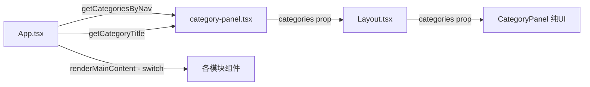
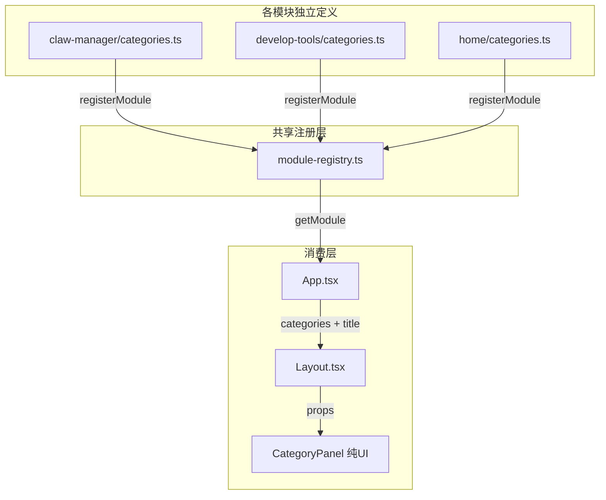

# CategoryPanel 解耦方案

## 一、现状分析

### 1.1 当前架构

当前 [`category-panel.tsx`](ran-rs-desktop/src/components/category-panel.tsx) 集中了所有模块的二级分类定义：

```
category-panel.tsx（143行）
├── CategoryItem 接口定义          ← 共享类型（合理）
├── k8sCategories[]                ← 开发工具模块的分类（耦合）
├── homeCategories[]               ← 首页分类（耦合）
├── settingsCategories[]           ← 设置分类（耦合）
├── aboutCategories[]              ← 关于分类（耦合）
├── clawManagerCategories[]        ← Claw管理模块的分类（耦合）
├── getCategoriesByNav()           ← switch 映射函数（耦合）
├── getCategoryTitle()             ← switch 映射函数（耦合）
└── CategoryPanel 组件             ← 纯 UI 展示组件（合理）
```

### 1.2 数据流



### 1.3 耦合问题

| 问题 | 影响 |
|------|------|
| 新增模块必须编辑 `category-panel.tsx` | 违反开闭原则，修改共享文件引入风险 |
| 所有模块图标集中在共享文件 import | 不相关的依赖被捆绑 |
| `getCategoriesByNav()` 使用 switch | 每增一个模块就要加一个 case |
| `getCategoryTitle()` 使用 switch | 同上 |
| `App.tsx` 的 `renderMainContent()` 也是 switch | 三处 switch 必须同步维护 |
| 模块分类 key 是硬编码字符串 | 无类型安全保障 |

### 1.4 涉及文件

| 文件 | 引用方式 | 需改动 |
|------|---------|--------|
| [`category-panel.tsx`](ran-rs-desktop/src/components/category-panel.tsx) | 定义所有分类 + switch + UI | ✅ 重构 |
| [`App.tsx`](ran-rs-desktop/src/App.tsx:4) | `import { getCategoriesByNav, getCategoryTitle }` | ✅ 重构 |
| [`layout.tsx`](ran-rs-desktop/src/components/layout.tsx:2) | `import type { CategoryItem }` | ⚠️ 类型路径可能变化 |
| [`category-panel.less`](ran-rs-desktop/src/components/category-panel.less) | 纯样式 | ❌ 不变 |
| [`sidebar.tsx`](ran-rs-desktop/src/components/sidebar.tsx) | 无直接引用 | ❌ 不变 |

---

## 二、推荐方案：模块注册机制

### 2.1 核心思路

> **每个模块自己定义分类，通过注册表汇聚，App.tsx 从注册表读取。**



### 2.2 新增文件结构

```
src/
├── modules/
│   ├── _shared/
│   │   ├── use-module-bus.ts          ← 已有
│   │   └── module-registry.ts         ← 🆕 模块注册表
│   ├── claw-manager/
│   │   ├── categories.ts              ← 🆕 分类定义
│   │   └── index.tsx                  ← 修改：导入并注册分类
│   ├── develop-tools/
│   │   ├── categories.ts              ← 🆕 分类定义（k8s + json2ts）
│   │   ├── telepresence/
│   │   └── json2ts/
│   └── home/
│       └── categories.ts              ← 🆕 分类定义
├── components/
│   ├── category-panel.tsx             ← 重构：只保留 CategoryItem 类型 + CategoryPanel UI
│   └── category-panel.less            ← 不变
└── App.tsx                            ← 重构：使用注册表
```

### 2.3 核心接口设计

#### `module-registry.ts` — 模块注册表

```typescript
// src/modules/_shared/module-registry.ts
import type { CategoryItem } from '../../components/category-panel';

/** 模块定义 */
export interface ModuleDefinition {
  /** 主导航 key（对应 sidebar 的 navKey） */
  navKey: string;
  /** 分类面板标题 */
  categoryTitle: string;
  /** 该模块的二级分类列表 */
  categories: CategoryItem[];
  /** 渲染主内容区域 */
  renderContent: (activeCategory: string) => JSX.Element | null;
}

/** 模块注册表（Map） */
const moduleMap = new Map<string, ModuleDefinition>();

/** 注册一个模块 */
export function registerModule(def: ModuleDefinition): void {
  moduleMap.set(def.navKey, def);
}

/** 获取模块定义 */
export function getModule(navKey: string): ModuleDefinition | undefined {
  return moduleMap.get(navKey);
}

/** 获取所有已注册模块的 navKey 列表 */
export function getRegisteredNavKeys(): string[] {
  return Array.from(moduleMap.keys());
}
```

#### 模块示例：`claw-manager/categories.ts`

```typescript
// src/modules/claw-manager/categories.ts
import { Document, Monitor, Setting } from '@element-plus/icons-vue';
import type { CategoryItem } from '../../components/category-panel';

export const clawManagerCategories: CategoryItem[] = [
  { key: 'claw-gateway', label: '网关管理', icon: Monitor, description: '网关启停、状态监控、Web面板' },
  { key: 'claw-config', label: '系统配置', icon: Setting, description: '初始化、模型配置、版本信息' },
  { key: 'claw-maintenance', label: '健康检查与维护', icon: Document, description: '环境自检、修复、升级、备份' },
];

export const clawManagerTitle = 'OpenClaw 管理';
```

#### 模块示例：`develop-tools/categories.ts`

```typescript
// src/modules/develop-tools/categories.ts
import { Connection, DocumentCopy } from '@element-plus/icons-vue';
import type { CategoryItem } from '../../components/category-panel';

export const developToolsCategories: CategoryItem[] = [
  { key: 'k8s-network-tools', label: 'k8s网络连接工具', icon: Connection, description: 'Telepresence 网络代理管理' },
  { key: 'json2ts', label: 'JSON → TypeScript', icon: DocumentCopy, description: 'JSON 类型转换工具' },
];

export const developToolsTitle = 'k8s网络连接工具';
```

#### `App.tsx` 重构后

```typescript
// App.tsx（核心变化部分）
import { getModule } from './modules/_shared/module-registry';

// 各模块自注册（副作用导入）
import './modules/claw-manager';       // 内部调用 registerModule()
import './modules/develop-tools';      // 内部调用 registerModule()

const App = defineComponent({
  name: 'App',
  setup() {
    const activeNav = ref('k8s');
    const activeCategory = ref('k8s-network-tools');

    const currentModule = computed(() => getModule(activeNav.value));
    const categories = computed(() => currentModule.value?.categories ?? []);
    const categoryTitle = computed(() => currentModule.value?.categoryTitle ?? '');

    const renderMainContent = () => {
      return currentModule.value?.renderContent(activeCategory.value) ?? null;
    };

    // ... 其余逻辑不变
  },
});
```

### 2.4 重构后的 `category-panel.tsx`

精简为只保留 **类型 + 纯 UI 组件**：

```typescript
// category-panel.tsx（重构后）
import type { PropType } from 'vue';
import type { Component } from 'vue';
import { defineComponent } from 'vue';
import { useCsNamespace } from '../hooks/use-namespace';
import './category-panel.less';

/** 分类项定义 */
export interface CategoryItem {
  key: string;
  label: string;
  icon: Component;
  description?: string;
}

/** 纯 UI 展示组件 */
const CategoryPanel = defineComponent({
  name: 'CategoryPanel',
  props: {
    categories: { type: Array as PropType<CategoryItem[]>, required: true },
    title: { type: String, default: '' },
    activeKey: { type: String, required: true },
    onSelect: { type: Function as PropType<(key: string) => void>, required: true },
  },
  setup(props) {
    const ns = useCsNamespace('category');
    // ... 渲染逻辑不变
  },
});

export default CategoryPanel;
```

---

## 三、实施步骤

### Step 1：创建模块注册表
- 新建 `src/modules/_shared/module-registry.ts`
- 定义 `ModuleDefinition` 接口和注册/查询函数

### Step 2：各模块创建 `categories.ts`
- `src/modules/claw-manager/categories.ts` — 导出 `clawManagerCategories` + `clawManagerTitle`
- `src/modules/develop-tools/categories.ts` — 导出 `developToolsCategories` + `developToolsTitle`
- `src/modules/home/categories.ts` — 导出 `homeCategories` + `homeTitle`（如有必要）

### Step 3：各模块入口注册自己
- `claw-manager/index.tsx` — 导入 categories + 调用 `registerModule()` + 提供 `renderContent`
- `develop-tools/index.ts` — 同上

### Step 4：精简 `category-panel.tsx`
- 删除所有分类定义常量
- 删除 `getCategoriesByNav()` 和 `getCategoryTitle()`
- 只保留 `CategoryItem` 接口 + `CategoryPanel` UI 组件

### Step 5：重构 `App.tsx`
- 删除对 `getCategoriesByNav` / `getCategoryTitle` 的导入
- 改为从 `module-registry` 获取当前模块定义
- `renderMainContent()` 委托给模块的 `renderContent()`

### Step 6：验证构建
- `rsbuild build` 确认通过
- 功能回归测试

---

## 四、影响范围

### 4.1 不需要修改的文件

| 文件 | 原因 |
|------|------|
| `category-panel.less` | 纯样式，无逻辑依赖 |
| `sidebar.tsx` / `sidebar.less` | 主导航独立，不涉及二级分类 |
| `layout.tsx` / `layout.less` | 只接收 props，接口不变 |
| `router/index.ts` | 路由配置独立 |
| `redis-desktop-manager/**` | 独立窗口模块，不使用 CategoryPanel |
| `pages/settings-page.tsx` | 独立窗口页面 |
| `pages/about-page.tsx` | 独立窗口页面 |

### 4.2 需要修改的文件

| 文件 | 变更内容 |
|------|---------|
| `category-panel.tsx` | 删除分类定义和 switch 函数，只保留类型+UI |
| `App.tsx` | 使用注册表替代 switch |
| `claw-manager/index.tsx` | 添加分类注册逻辑 |
| `develop-tools/index.ts` | 添加分类注册逻辑 |

### 4.3 新增文件

| 文件 | 内容 |
|------|------|
| `modules/_shared/module-registry.ts` | 注册表接口和函数 |
| `modules/claw-manager/categories.ts` | Claw 管理分类定义 |
| `modules/develop-tools/categories.ts` | 开发工具分类定义 |

---

## 五、备选方案对比

### 方案 A：模块注册机制（推荐 ✅）

**优点：**
- 完全解耦，新增模块只需在自己目录下定义分类并注册
- `category-panel.tsx` 变成纯 UI + 类型，零业务逻辑
- `App.tsx` 的 `renderMainContent()` 不再需要 switch
- 符合开闭原则

**缺点：**
- 新增 1 个注册表文件 + N 个 categories 文件
- 需要理解注册模式

### 方案 B：简单拆分（仅移动分类定义）

只把分类定义移到各模块，`App.tsx` 手动 import 各模块的 categories 组装 Map。

**优点：**
- 改动更小，不需要注册表

**缺点：**
- `App.tsx` 仍需手动 import 每个模块的分类
- `renderMainContent()` 的 switch 仍然存在
- 新增模块仍需修改 App.tsx 多处

### 方案 C：路由元信息扩展

在 Vue Router 的 `meta` 中扩展分类信息，通过路由配置驱动。

**优点：**
- 利用路由基础设施

**缺点：**
- 当前架构中主窗口不走路由（`App.tsx` 是 SPA 内部状态切换，不是路由切换）
- Redis/Settings/About 是独立窗口走路由，但它们不需要 CategoryPanel
- 过度设计，不匹配当前架构

---

## 六、结论

**推荐方案 A（模块注册机制）**，理由：

1. 当前 4 个模块已有耦合问题，未来模块增多会更严重
2. 注册机制是前端常见的解耦模式，团队易于理解
3. 改动范围可控：4 个文件修改 + 3 个文件新增
4. `redis-desktop-manager` 模块完全不受影响（它不使用 CategoryPanel）
5. `CategoryPanel` 纯 UI 组件和 `category-panel.less` 完全不变
