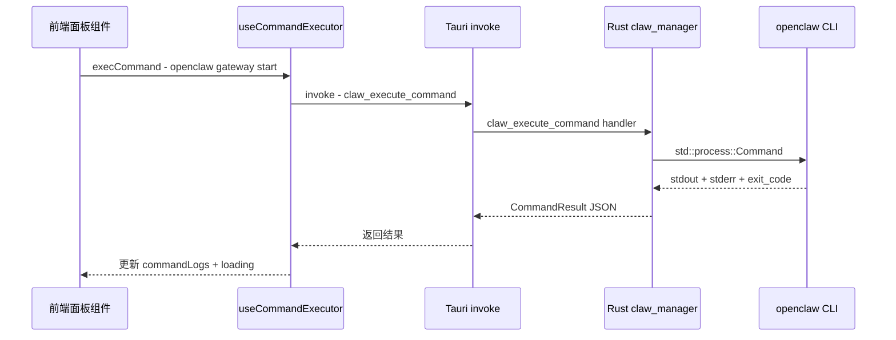

# Claw Manager Rust 后端集成计划

## 1. 背景与目标

当前前端 `claw-manager` 模块的所有 `openclaw` 命令执行都是通过 `setTimeout` 模拟的，没有真实执行。需要：

1. 在 Rust 后端创建 `claw_manager` 模块
2. 通过 `std::process::Command` 真实执行 `openclaw` CLI 命令
3. 将执行结果（stdout/stderr/exit code）返回前端
4. 更新前端 `use-command-executor.ts` 调用 Tauri 后端

## 2. 现有架构分析

### 2.1 Rust 后端结构

```
src-tauri/src/
├── lib.rs              # 应用入口，注册所有 Tauri 命令
├── main.rs             # 程序入口
├── shared/             # 共享工具
└── modules/
    ├── mod.rs          # 模块声明：redis_desktop, telepresence
    ├── redis_desktop/  # Redis 桌面管理（复杂模块，多子模块）
    └── telepresence/   # Telepresence（简单模块，单文件 mod.rs）
```

### 2.2 命令注册模式

项目使用**直接命令注册模式**（非 Plugin），在 [`lib.rs`](ran-rs-desktop/src-tauri/src/lib.rs:20) 中通过 `tauri::generate_handler![]` 统一注册。

### 2.3 前端命令调用模式

前端各面板通过 [`useCommandExecutor()`](ran-rs-desktop/src/modules/claw-manager/hooks/use-command-executor.ts:30) composable 调用命令：

```typescript
// 当前 API（模拟）
execCommand(cmd, successOutput, duration?, url?)
// 例如：
execCommand("openclaw gateway start", "✓ 网关已启动", 1500, "http://127.0.0.1:8080")
```

**问题**：`successOutput` 和 `duration` 是硬编码的模拟数据，需要替换为真实执行结果。

### 2.4 涉及的面板和命令

| 面板 | 命令示例 |
|------|---------|
| gateway-panel | `openclaw gateway start/stop/restart/status`, `openclaw dashboard`, `openclaw tui` |
| config-panel | `openclaw config path/get/set/unset/validate` |
| maintenance-panel | `openclaw maintenance health/logs/clean/version/update` |
| agents-panel | `openclaw agents create/list/info/edit/remove/enable/disable/call` |
| skills-panel | `openclaw skills list/info/check/install/enable/disable` |
| wiki-panel | `openclaw wiki init/status/search/reindex/list-docs` |
| cron-panel | `openclaw cron list/create/update/delete/enable/disable/run` |
| sessions-panel | `openclaw sessions list/info/messages/clear` |
| channels-panel | `openclaw channels list/create/update/delete/enable/disable/test` |

## 3. 架构设计

### 3.1 数据流



### 3.2 Rust 模块结构

```
src-tauri/src/modules/claw_manager/
├── mod.rs          # 模块入口，声明子模块，导出公共 API
├── commands.rs     # Tauri 命令函数（#[tauri::command]）
├── executor.rs     # 核心命令执行器（std::process::Command 封装）
└── models.rs       # 请求/响应结构体（serde 序列化）
```

### 3.3 Rust 数据结构

```rust
// models.rs

/// 命令执行请求
#[derive(Debug, serde::Deserialize)]
pub struct CommandRequest {
    /// 完整命令字符串，如 "openclaw gateway start"
    pub command: String,
    /// 可选的工作目录
    pub cwd: Option<String>,
    /// 可选的环境变量
    pub env: Option<std::collections::HashMap<String, String>>,
    /// 超时时间（秒），默认 30
    pub timeout_secs: Option<u64>,
}

/// 命令执行结果
#[derive(Debug, serde::Serialize)]
pub struct CommandResult {
    /// 是否执行成功（exit code == 0）
    pub success: bool,
    /// 标准输出
    pub stdout: String,
    /// 标准错误
    pub stderr: String,
    /// 退出码
    pub exit_code: Option<i32>,
    /// 合并后的输出（stdout + stderr）
    pub output: String,
    /// 执行耗时（毫秒）
    pub duration_ms: u64,
}
```

### 3.4 Rust 命令函数

```rust
// commands.rs

/// 执行 openclaw 命令（异步，不阻塞 UI 线程）
#[tauri::command]
pub async fn claw_execute_command(
    command: String,
    cwd: Option<String>,
    env: Option<std::collections::HashMap<String, String>>,
    timeout_secs: Option<u64>,
) -> Result<CommandResult, String>

/// 检查 openclaw CLI 是否可用
#[tauri::command]
pub fn claw_check_cli() -> Result<ClawCliInfo, String>
```

### 3.5 前端 API 变更

**`use-command-executor.ts` 新 API 设计：**

```typescript
// 新 API（真实执行）
execCommand(cmd: string, options?: ExecOptions): Promise<CommandResult>

interface ExecOptions {
  cwd?: string
  env?: Record<string, string>
  timeout?: number
  // 前端展示用：命令执行成功后的附加 URL
  url?: string
}

// 返回值直接来自 Rust 后端
interface CommandResult {
  success: boolean
  stdout: string
  stderr: string
  exitCode: number | null
  output: string      // stdout + stderr 合并
  durationMs: number
}
```

**关键变化**：
- 移除 `successOutput` 参数（硬编码模拟数据）→ 改为使用真实 `stdout`
- 移除 `duration` 参数（模拟延迟）→ 改为使用真实执行耗时
- 保留 `url` 参数（前端展示用，如 Dashboard 地址）
- `CommandLogEntry.output` 改为显示真实命令输出

## 4. 文件变更清单

### 4.1 新建文件（Rust 后端）

| 文件 | 说明 |
|------|------|
| `src-tauri/src/modules/claw_manager/mod.rs` | 模块入口 |
| `src-tauri/src/modules/claw_manager/commands.rs` | Tauri 命令 |
| `src-tauri/src/modules/claw_manager/executor.rs` | 命令执行器 |
| `src-tauri/src/modules/claw_manager/models.rs` | 数据结构 |

### 4.2 修改文件（Rust 后端）

| 文件 | 变更 |
|------|------|
| `src-tauri/src/modules/mod.rs` | 添加 `pub mod claw_manager;` |
| `src-tauri/src/lib.rs` | 在 `generate_handler![]` 中注册新命令 |

### 4.3 修改文件（前端）

| 文件 | 变更 |
|------|------|
| `src/modules/claw-manager/hooks/use-command-executor.ts` | 替换 setTimeout 为 invoke 调用 |
| `src/modules/claw-manager/types/index.ts` | 更新 CommandResult 类型 |
| `src/modules/claw-manager/components/gateway-panel.tsx` | 适配新 execCommand API |
| `src/modules/claw-manager/components/config-panel.tsx` | 适配新 execCommand API |
| `src/modules/claw-manager/components/maintenance-panel.tsx` | 适配新 execCommand API |
| `src/modules/claw-manager/components/agents-panel.tsx` | 适配新 execCommand API |
| `src/modules/claw-manager/components/skills-panel.tsx` | 适配新 execCommand API |
| `src/modules/claw-manager/components/wiki-panel.tsx` | 适配新 execCommand API |
| `src/modules/claw-manager/components/cron-panel.tsx` | 适配新 execCommand API |
| `src/modules/claw-manager/components/sessions-panel.tsx` | 适配新 execCommand API |
| `src/modules/claw-manager/components/channels-panel.tsx` | 适配新 execCommand API |

## 5. 实施步骤

### Step 1: 创建 Rust claw_manager 模块

创建 4 个 Rust 文件：
- `models.rs` — 定义 `CommandRequest`、`CommandResult`、`ClawCliInfo` 结构体
- `executor.rs` — 封装 `std::process::Command`，支持超时、工作目录、环境变量
- `commands.rs` — 定义 `claw_execute_command` 和 `claw_check_cli` 两个 Tauri 命令
- `mod.rs` — 模块入口，声明子模块

### Step 2: 注册 Rust 命令

- `modules/mod.rs` 添加 `pub mod claw_manager;`
- `lib.rs` 的 `generate_handler![]` 中添加：
  - `modules::claw_manager::commands::claw_execute_command`
  - `modules::claw_manager::commands::claw_check_cli`

### Step 3: 更新前端类型定义

在 `types/index.ts` 中更新 `CommandResult` 接口，添加 `stdout`、`stderr`、`exitCode`、`durationMs` 字段。

### Step 4: 重写 use-command-executor.ts

- 移除 `setTimeout` 模拟
- 使用 `invoke("claw_execute_command", { command, cwd, env, timeoutSecs })` 调用 Rust 后端
- 简化 `execCommand` 签名为 `(cmd, options?)` 
- `CommandLogEntry.output` 使用真实 `output` 字段

### Step 5: 更新各面板组件

所有面板的 `execCommand` 调用需要适配新 API：
- 移除 `successOutput` 参数（第二个参数）
- 移除 `duration` 参数（第三个参数）
- `url` 通过 `options.url` 传递
- 命令执行后的副作用逻辑（如更新状态）改为基于 `CommandResult.success` 判断

### Step 6: 编译验证

- `cargo build` 验证 Rust 编译
- ESLint 验证前端代码

## 6. 关键设计决策

### 6.1 同步 vs 异步执行

使用 `tokio::task::spawn_blocking` 包装 `std::process::Command`，避免阻塞 Tauri 的异步运行时。命令执行设置默认 30 秒超时。

### 6.2 命令白名单校验

在 `executor.rs` 中添加命令前缀校验，确保只执行 `openclaw` 开头的命令，防止命令注入：

```rust
fn validate_command(cmd: &str) -> Result<(), String> {
    if !cmd.starts_with("openclaw") {
        return Err("只允许执行 openclaw 命令".to_string());
    }
    Ok(())
}
```

### 6.3 向后兼容

前端 `execCommand` 保留 `url` 参数支持（通过 options 对象），确保 `CommandLogPanel` 不需要修改。
